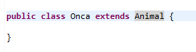
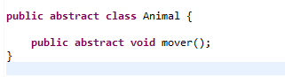
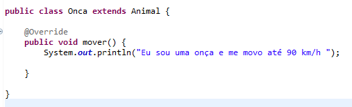
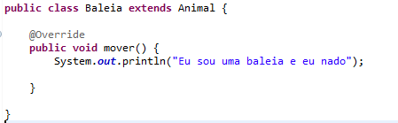

# Herança na prática e o poder do Polimorfismo

Uma das matérias mais interessantes e mais complexas da Programação Orientada a Objetos, Nesse tópico vou comentar detalhadamente, mostrar utilidades e o que pode ou não pode ser feito.

## Herança

Herança é um dos pilares da Programação Orientada a Objetos (POO) e permite que uma classe (chamada classe filha ou subclasse) herde características e comportamentos de outra classe (chamada classe pai ou superclasse). A herança é feita a partir da palavra chave extends ou implements (Dependendo da classe pai ser uma classe padrão ou uma interface), com isso, a classe filha pode reutilizar código da classe pai e ainda estender ou modificar funcionalidades para se adequar às suas necessidades. 

#### O que acontece depois do extends ?

Nesse momento está formada a herança, a classe filha firma um "contrato" com a classe pai, onde seus campos devem ou podem ser implementados, dependendo da lógica do sistema. Imaginem um animal, pode ser qualquer animal, uma baleia, um tucano ou uma onça, o conceito animal é abstrato e diversos tipos podem se encaixar, dentro dessa hierarquia ainda existe grupos que esses animais pertence, dependendo de suas caracteristicas. Uma onça por exemplo está no grupo dos felinos e deve herda caracteriscas desse grupo, mais também está no grupo de animal, onde todos compartilham algumas caracteristicas em comum, como se mover, fazer som, e muitas outras.

É aqui que entra o polimorfismo, cada animal tem caracteristicas em comum, porém com jeitos diferentes de se fazer. Uma onça se move com as patas em certa velocidade, uma baleia move-se nadando, enquanto um tucano move-se voando e todos herdam a caracteristica mover da superclasse Animal. 

## Polimorfismo

O polimorfismo é um dos conceitos fundamentais da programação orientada a objetos (POO) e é amplamente utilizado em Java. O termo polimorfismo se refere à capacidade de um objeto assumir diferentes formas, ou seja, uma mesma operação pode ser realizada por diferentes objetos de classes diferentes.

#### Polimorfismo em tempo de execução ou Sobrescrita(Override)

Ocorre quando uma classe filha sobrescreve um método da classe pai. O método que será executado é decidido em tempo de execução, com base no tipo de objeto que está invocando o método.

Para ilustar o polimorfismo de sobrescrita vou usar uma superclasse chamada de Automovel, ela é uma classe abstrata e tem duas variaveis, cor de automovio e tipo de automovio, e também tem dois métodos, aceleração máxima e descrição do automóvel:

[img]

Classes abstratas são comumente usadas para serem superclasses, elas carregam a palavra chave abstract na assinatura da classe ou metodo, onde seu diferencial é que não podem ser instanciada, embora possam ter construtores para iniciar seus campos através das subclasses, elas tem o papel de ser uma classe suporte, podedendo ter metodos comuns, estáticos e também abstratos. Os metodos abstratos não possuim corpos e sua função e ser passada obrigatoriamente para as subclasses, como uma espécie de contrato. 

Criei uma subclasse chamada de Corolla, ela estende a superclasse Automovel firmando a herança: 

[img]

#### Polimorfismo em tempo de compilação ou Polimorfismo de sobrecarga(Overload)

Ocorre quando você tem múltiplos métodos com o mesmo nome, mas com parâmetros diferentes (tipo ou número de parâmetros) na mesma classe. O compilador decide qual método chamar com base na assinatura do método durante a compilação
